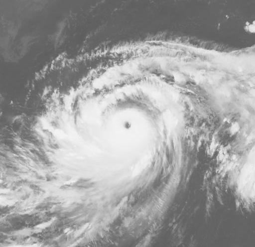

# Western Pacific Typhoon trajetories prediction

### General description: 

In this project, different deep learning frameworks were proposed to analyze historical typhoon data from the NOAA archive and the Kitamoto laboratory data repository. The objective was to predict the tracks of typhoons in the Western Pacific Region for the next 3 hours and 6 hours. Through experimentation, it was observed that the LSTM regression model and the CNN-LSTM ensemble model yielded similar results for the 3-hour prediction. However, when it came to the 6-hour prediction, the CNN-LSTM ensemble model outperformed other deep learning approaches employed in this project. These findings suggest that the CNN-LSTM ensemble model has the potential to provide more accurate predictions, particularly if diverse image data types are incorporated to extract relevant track features in the model.


### Typhoon Image Data web scrapping from http://agora.ex.nii.ac.jp/digital-typhoon/
A Typhoon_image_scrapping_tool.py is provided in this respository. Simply clone this repository and install all the dependencies. You will be able to run this script and scrap the typhoon images accordingly.

Clone the respository
```
git clone https://github.com/manhim1218/typhoon_tracker.git
```

Install the dependencies for scrapping
```
pip install -r requirements.txt
```

Run the web scarpping script
```
python3 Typhoon_image_scrapping_tool.py
```

#### Predicting the Western Pacific Region tropical cyclones trajectories using various Deep Learning Approaches
``` 
All details can be found at Thesis.pdf. 
The report outlines project motivations, model implementation methodologies and results details.
```

### Summary (last update: July 2022)
#### Deep learning framework: Pytorch

#### 1. Meteorological data: 
```
Latitude 
Longitude 
Distance to Land 
Wind
Pressure
Radius of maximum wind in 34 miles (NE), Radius of maximum wind in 34 miles (SE), 
Radius of maximum wind in 34 miles (SW), Radius of maximum wind in 34 miles (NW), 
Radius of maximum wind in 50 miles (NE), Radius of maximum wind in 50 miles (SE), 
Radius of maximum wind in 50 miles (SW), Radius of maximum wind in 50 miles (NW), 
Radius of maximum wind in 64 miles (NE), Radius of maximum wind in 64 miles (SE), 
Radius of maximum wind in 64 miles (SW), Radius of maximum wind in 64 miles (NW) 
```

#### 2. Image Data

<p align=""></p>

one of the satellite image example for training in a CNN-LSTM model

#### 3. Model architecture


3.1 LSTM Regression model

<p align=""></p>


3.2 CNN-LSTM ensemble model


<p align=""></p>


3.3 LSTM Classification model


<p align=""></p>


### Model comparison on RMSE 3 hours and 6 hours track error 

<p align=""></p>

### One of the examples of visulaising 3 hours track prediction on Supertyphoon Manghkurt from CNN-LSTM ensemble model

<p align="center"></p>

### One of the examples of visulaising 6 hours track prediction on Supertyphoon Manghkurt from CNN-LSTM ensemble model

<p align="center"></p>

### Numerical Data (17 meteorological features)
Full WP dataset.csv is provided in this respository. Original csv file can be downloaded from the NOAA data archive.
